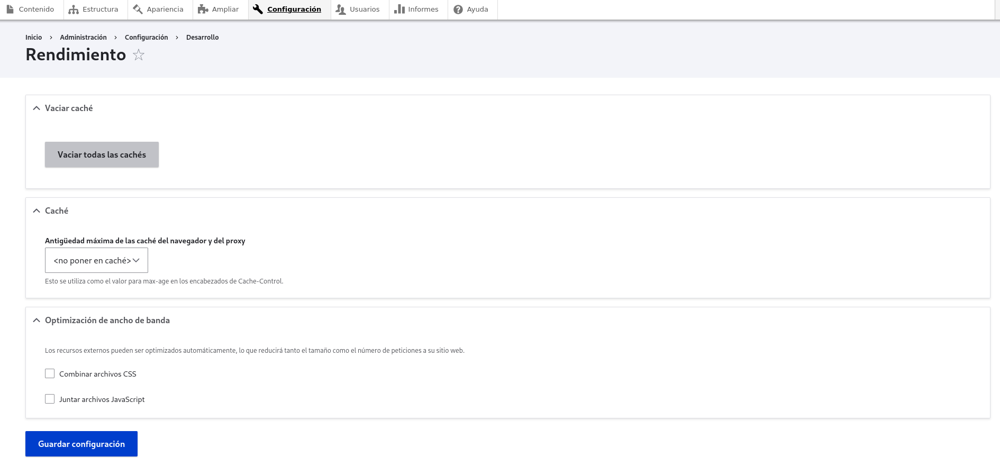

# Instalación de Tema y Plugins para Plantilla Gob.bo

##  1. Requerimientos Previos

Antes de comenzar, asegúrate de que tienes instaladas las siguientes herramientas:
En cuanto a base de datos puedes elegir entre MariaDB o PostgreSQL

| **Nombre**     | **Versión Recomendada** | **Descripción** | **Instalación** |
|---------------|-----------------------|---------------|----------------|
| `MariaDB`     | ^10.6.18 | Alternativa a MySQL, compatible con Drupal | [Descargar](https://mariadb.org/) |
| `PostgreSQL`  | ^14.5  | Alternativa gestor de base de datos SQL | [Descargar](https://www.postgresql.org/download/linux/debian) |
| `Composer`    | 2.7.7   | Gestor de dependencias de PHP (necesario para Drupal) | [Instalar](https://getcomposer.org/download/) |
| `Drupal Core` | 10.3.2  | CMS para la gestión del sitio web | [Descargar](https://new.drupal.org/download) |


> **Nota:** Necesitas instalar PHP asegurandote de que sea compatible con Drupal 10, y para usar **PostgreSQL** necesitas tener instalado el paquete php-pgsql

---

## 2. Instalación de Drupal
1. Abre una terminal y navega a la carpeta donde deseas instalar el proyecto.
2. Ejecuta el siguiente comando para instalar Drupal usando Composer:
   ```bash
   composer create-project drupal/recommended-project:^10.3 mi_proyecto
   ```
   (Reemplaza `mi_proyecto` con el nombre de tu proyecto).
3. Accede a la carpeta del proyecto:
   ```bash
   cd mi_proyecto
   ```

Tienes los siguientes metodos para levantar el proyecto puedes elegir uno de ellos:

   - Levanta un servidor de desarrollo rápido

   - Configuración de Apache

   - Levantar el proyecto con **Docker**

Los procedimientos de cada punto son los siguientes:

a). Levanta un servidor de desarrollo rápido:
   
   Ejecuta el siguiente script.
   ```bash
   php -S 127.0.0.1:8080 -t web/
   ```
   Luego accede en el navegador a `http://127.0.0.1:8080`.

b). Configuración de Apache:
   - Si prefieres usar Apache, crea un archivo de configuración virtual host:
     ```apache
     <VirtualHost *:80>
       DocumentRoot "/ruta/a/mi_proyecto/web"
       ServerName midominio.local
       <Directory "/ruta/a/mi_proyecto/web">
         AllowOverride All
         Require all granted
       </Directory>
     </VirtualHost>
     ```
   - Habilita el sitio y reinicia Apache:
     ```bash
     sudo a2ensite midominio.local.conf
     sudo systemctl restart apache2
     ```
   - Accede en el navegador a `http://midominio.local`.

c). Levantar el proyecto con **Docker**:
   - Crea un archivo `docker-compose.yml` en la raíz del proyecto:
     ```yaml
     # Con MariaDB

     version: '3.8'
     services:
       drupal:
         image: drupal:10
         ports:
           - "8080:80"
         volumes:
           - ./web:/var/www/html
         depends_on:
           - db
       db:
         image: mariadb:10.6
         restart: always
         environment:
           MYSQL_DATABASE: drupal
           MYSQL_USER: usuario
           MYSQL_PASSWORD: contraseña
           MYSQL_ROOT_PASSWORD: rootpass
         ports:
           - "3306:3306"
      ```
      
      ```yaml
      # Con PostgeSQL

      version: '3.8'
      services:
      drupal:
         image: drupal:10
         ports:
            - "8080:80"
         volumes:
            - ./web:/var/www/html
         depends_on:
            - db
         environment:
            DRUPAL_DATABASE_DRIVER: pgsql
            DRUPAL_DATABASE_HOST: db
            DRUPAL_DATABASE_PORT: 5432
            DRUPAL_DATABASE_NAME: drupal
            DRUPAL_DATABASE_USER: usuario
            DRUPAL_DATABASE_PASSWORD: contraseña

      db:
         image: postgres:14.5
         restart: always
         environment:
            POSTGRES_DB: drupal
            POSTGRES_USER: usuario
            POSTGRES_PASSWORD: contraseña
         ports:
            - "5432:5432"
         volumes:
            - pgdata:/var/lib/postgresql/data

      volumes:
      pgdata:

     ```
   - Luego, ejecuta el siguiente comando para iniciar los contenedores:
     ```bash
     docker-compose up -d
     ```
   - Accede a `http://localhost:8080` en tu navegador.

Una vez levantado debe configurar Druppal:

- Elige el idioma **Español**
- Elegir el tipo de proyecto como: **Estandar**
- Elige el tipo de base de datos MySQL, MariaDB, y llena los datos referentes a tu base de datos.
- Configura el nombre de tu sitio, correo electronico, nombre de usuario, y contraseña.
- Y le llevara al sitio o haz click en Ir a Sitio
- Ve a configuración -> rendimiento -> vacia caches ->  desactiva las opciones de **Optimización de ancho de banda** -> guardar configuración


📌 **Referencia**: Más detalles en la [documentación oficial de Drupal](https://www.drupal.org/docs/getting-started/installing-drupal/drupal-quick-start-command).

---

## 3. Instalación del Tema y Módulos Personalizados
### 3.1 Instalación del Tema
1. Instalar el tema base **Bootstrap Barrio** con Composer:
   ```bash
   composer require drupal/bootstrap_barrio:^5.5
   ```
2. Crear la carpeta para temas personalizados dentro del proyecto:
   ```bash
   mkdir -p web/themes/custom
   ```
3. Copiar la carpeta del tema personalizado desde el repositorio clonado:
   ```bash
   cp -r <ruta_del_repositorio>/themes/custom/ ./web/themes/
   ```
---

### 3.2 Instalación de Módulos Personalizados
1. Crear la carpeta para módulos personalizados en el proyecto:
   ```bash
   mkdir -p web/modules/custom
   ```
2. Copiar los módulos personalizados desde el repositorio clonado:
   ```bash
   cp -r <ruta_del_repositorio>/modules/custom/ ./web/modules/
   ```

---

## 4. Configuraciones del Tema

#### Opción 1 - Sincronizar configuraciones

   Instalar Drush. 
   ```bash
   composer require drush/drush
   ```

   Está opción restaura las configuraciones necesarias del tema. 
   ```bash
   drush config:import --partial --source=themes/custom/gobbo_tema/config/optional
   ```
   Probablemente salga un error de importacións de accesos directo "Shortcuts. Para solucionarlo dirigirse a `/admin/modules/uninstall/entity/shortcut` y *Elimina todos los enlaces de acceso directo*

   Volver a ejecuar la importación.
   Está opción devuelve el tema en su estado más básico. 

#### Opción 2 - Sincronizar mediante restauración de base de datos 

Sigue estos pasos para importar el backup.sql, la base de datos:

1. **Importar el backup** en MariaDB o PostgreSQL:

   **Si usas MariaDB o MySQL**
   ```bash
   mysql -u usuario -p nombre_base_de_datos < backup.sql
   ```

2. **Configurar Drupal para apuntar a la base de datos**:
   - Edita el archivo `web/sites/default/settings.php` y asegúrate de que la configuración de la base de datos sea correcta.

   ```bash
   # MariaDB

   $databases['default']['default'] = array (
   'database' => '<databasename>',
   'username' => '<user>',
   'password' => '<password>',
   'prefix' => '',
   'host' => 'localhost',
   'port' => '3306',
   'isolation_level' => 'READ COMMITTED',
   'driver' => 'mysql',
   'namespace' => 'Drupal\\mysql\\Driver\\Database\\mysql',
   'autoload' => 'core/modules/mysql/src/Driver/Database/mysql/',
   );
   ```

   ```bash
   #PostgreSQL

   $databases['default']['default'] = array (
   'database' => '<databasename>',
   'username' => '<user>',
   'password' => '<password>',
   'prefix' => '',
   'host' => 'localhost',
   'port' => '5432',
   'driver' => 'pgsql',
   'namespace' => 'Drupal\\pgsql\\Driver\\Database\\pgsql',
   'autoload' => 'core/modules/pgsql/src/Driver/Database/pgsql/',
      );

   ```
---

## 5. Configuración del Tema y Módulos

Dirigirse a lara ruta:
   - URL: `http://tusitio.com/user/login` e ingresar con el usuario con rol de administrador.
### 5.1 Activar el Tema Gob.bo
1. Accede al panel de administración de Drupal:
   - URL: `http://tusitio.com/admin/appearance`
2. Busca el tema **Gob.bo** y en caso que no este como predeterminado haz clic en **Instalar y establecer como predeterminado**.

---

### 5.2 Activar los Módulos del Tema
1. Ve a `http://tusitio.com/admin/modules`.
2. Usa el buscador y escribe **gobbo**.
3. Asegurate que los modulos esten activados sino activa los siguientes módulos personalizados:
   - ✅ Bloque Carrusel
   - ✅ Bloques Generales Gob.bo
   - ✅ Módulo para Consumo de API Trámites Gob.bo
4. Guarda los cambios.

---
### 5.3 Módulos externos
Se usa un módulo externo para genera el mapa de sitio.
1. Instalar  **Sitemap** con Composer:
   ```bash
   composer require 'drupal/sitemap:^2.0'
   ```
2. Ve a `http://tusitio.com/admin/modules`.
2. Usa el buscador y escribe **sitemap**.
3. Asegurate que el módulo este activado sino activa el siguiente módulo
   - ✅ Sitemap
4. Guarda los cambios.


## 6. Limpieza de Caché y Configuración Final
Para aplicar todos los cambios correctamente, es importante limpiar la caché del sistema:


1. Ir a `http://tusitio.com/admin/config/development/performance`.
2. Hacer clic en **Vaciar todas las cachés**.
3. También puedes ejecutar el siguiente comando en terminal:
   ```bash
   drush cache:rebuild
   ```

---

## 7. Administración y Construcción del Sitio
Ahora puedes empezar a construir tu página con los bloques y elementos disponibles del tema Gob.bo.

📌 **Recomendaciones**:

✔ Revisa las configuraciones en `admin/config`.  
✔ Personaliza los bloques en `admin/structure/block`.  
✔ Si usas Composer, recuerda actualizar regularmente:
   ```bash
   composer update
   ```

---

## Soporte y Problemas Comunes
Si tienes problemas:
- Verifica los permisos de los archivos (`chmod -R 755 web/sites/default`).
- Asegúrate de que PHP tiene las extensiones necesarias (`php -m`).
- Revisa los logs de errores en `admin/reports/dblog`.

---

### Tu instalación de Drupal con el tema Gob.bo está completa.

Ya puede empezar a armar la página con los bloques y elementos disponibles.

Guia para usar el sitio: [Guia](./docs/GUIDE.md)
