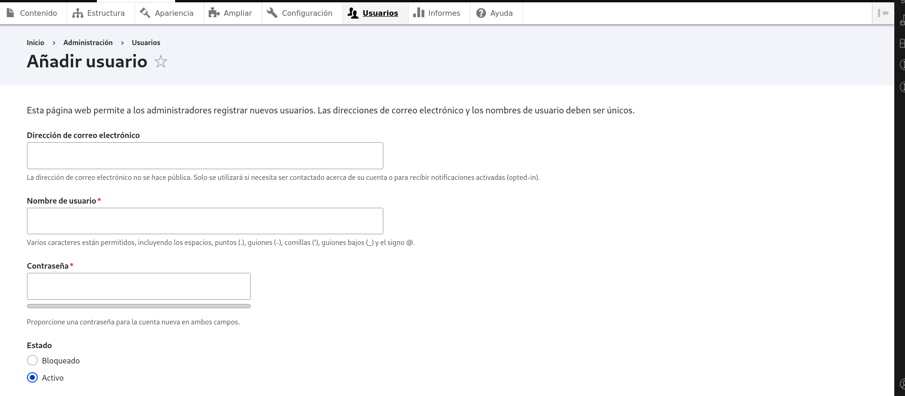
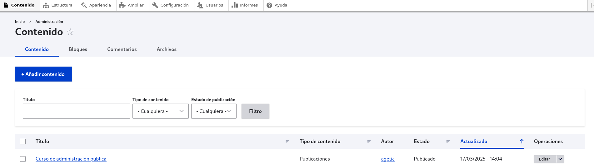
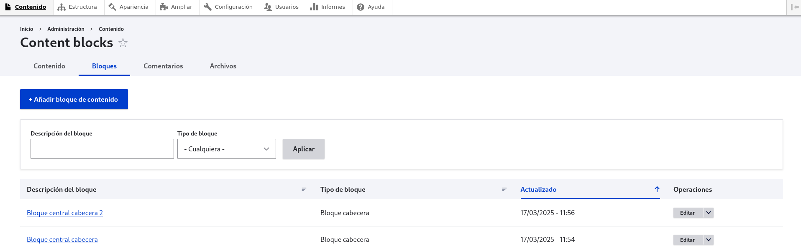
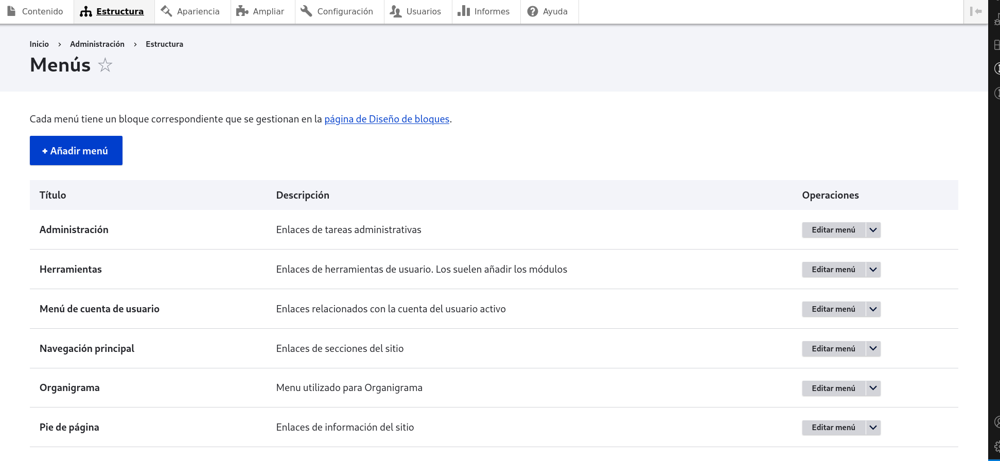

# Guía de Configuración del Sitio

## 🔐 Iniciar Sesión  
Para acceder al panel de administración, dirígete a la siguiente URL e inicia sesión con un usuario con el **rol de administrador**: 

-> `http://tusitio.com/user/login`

## 👥 Gestión de Usuarios  
Para crear y administrar usuarios, dirígete a la sección **Usuarios** en el menú de administración.  

### Añadir Nuevo Usuario  
Esta página permite a los administradores registrar nuevos usuarios.  
**Los nombres de usuario y direcciones de correo deben ser únicos.**  

####  Datos del Usuario:  
- **Dirección de correo electrónico**: No es pública, solo se usa para notificaciones.  
- **Nombre de usuario**: Puede incluir espacios, puntos (.), guiones (-), comillas ('), guiones bajos (_) y el signo @.  
- **Contraseña**: Debe introducirse dos veces y mostrará un indicador de fortaleza.  
- **Estado**: Puede ser **Bloqueado** o **Activo**.  
- **Roles**:  
  - Usuario autenticado  
  - Editor de contenido  
  - Administrador 
- **Notificar al usuario sobre su nueva cuenta**: Se puede enviar un correo al usuario con sus credenciales.  

#### Imagen de Perfil  
- Se puede subir una imagen (foto de perfil).  
- **Formatos permitidos**: PNG, GIF, JPG, JPEG, WEBP.  
- **Tamaño máximo**: 64 MB.  

#### Opciones de Regionalización  
- **Idioma del sitio**: Idioma preferido para notificaciones y correos electrónicos.  
- **Zona horaria**: Configuración de la zona horaria del usuario.  

#### Opciones de Contacto  
- **Formulario de contacto personal**: Permite que otros usuarios envíen mensajes sin revelar la dirección de correo electrónico.  

---

💡 **Consejo:** Personaliza los roles y permisos según las necesidades de tu sitio para una mejor gestión de usuarios.

## 🛠 Configuración de Contenido y Bloques  
Una vez dentro del sistema, dirígete a la pestaña **"Contenido"** en el menú de administración. Desde aquí, puedes gestionar diferentes aspectos del sitio:

### Contenido  
En esta sección puedes agregar contenido clasificado por **tipo de contenido**.  
🔹 Ejemplo: Artículos, páginas, blogs, etc.




### Bloques  
Aquí puedes añadir **bloques** según el tipo de bloque disponible en el sistema.  
🔹 Ejemplo: Menús, encabezados, pies de página, widgets personalizados.



### Comentarios  
Desde esta pestaña, puedes visualizar y moderar los comentarios publicados por los usuarios.

### 📂 Archivos  
En esta sección se encuentran los **archivos usados por el sistema**, como imágenes, documentos y otros recursos subidos a Drupal.

---  
## 📖 Acceder a la Configuración de Menús
Para gestionar los menús en Drupal, sigue estos pasos:

1. Ve a **Estructura → Menús** o accede desde la URL:  
```bash
http://tusitio.com/admin/structure/menu
```
2. Allí verás una lista con todos los menús disponibles.
3. Puedes **editar un menú existente** o **añadir un nuevo menú**.

---

## Menús Predeterminados 



| **Título**                     | **Descripción** |
|--------------------------------|----------------|
| **Administración**             | Enlaces de tareas administrativas. |
| **Herramientas**               | Enlaces de herramientas de usuario añadidos por módulos. |
| **Menú de cuenta de usuario**  | Enlaces relacionados con la cuenta del usuario activo. |
| **Navegación principal**       | Enlaces de secciones principales del sitio. |
| **Organigrama**                | Menú utilizado para mostrar el organigrama. |
| **Pie de página**              | Enlaces de información del sitio. |

---

## Editar un Menú Existente

1. En la página de **Menús**, busca el menú que quieres modificar.
2. Haz clic en **"Editar menú"**.
3. Puedes:
- **Añadir enlaces nuevos** dentro del menú.
- **Modificar o eliminar enlaces existentes**.
- **Cambiar el orden de los enlaces** arrastrándolos.
4. Guarda los cambios.

---

## Gestionar la Ubicación de los Menús

Cada menú tiene un **bloque correspondiente** que se gestiona en la página de **Diseño de bloques**:

1. Ve a **Diseño → Diseño de bloques** (`/admin/structure/block`).
2. Encuentra el bloque del menú que deseas modificar.
3. Ubícalo en la región deseada (encabezado, barra lateral, pie de página, etc.).
4. Guarda los cambios.

# 🔧 Gestionar la Configuración
 
- **Configuración Básica**: Editar nombre, correo, eslogan y páginas de error.  

- **Cron**: Administrar tareas automáticas.  

- **Contenido**: Configurar editores de texto y filtros.  

- **Búsqueda y URLs**: Configurar búsqueda y alias de URL.  
 
- **Multimedia**:Gestionar imágenes, archivos y herramientas de edición.  

- **Servicios Web**: Configurar RSS y menú linkset.  

- **Usuarios**: Gestionar cuentas, roles y permisos.  

- **Interfaz**: Configurar atajos y personalización. 

- **Desarrollo**:  
  - Optimizar rendimiento, logs, errores y mantenimiento.  
  - Importar/exportar configuraciones.  

- **Región e Idioma**: Configurar zona horaria, formatos, idiomas y traducción. 

💡 **Consejo:** Revisa las configuraciones de cada sección para personalizar tu sitio según tus necesidades.

